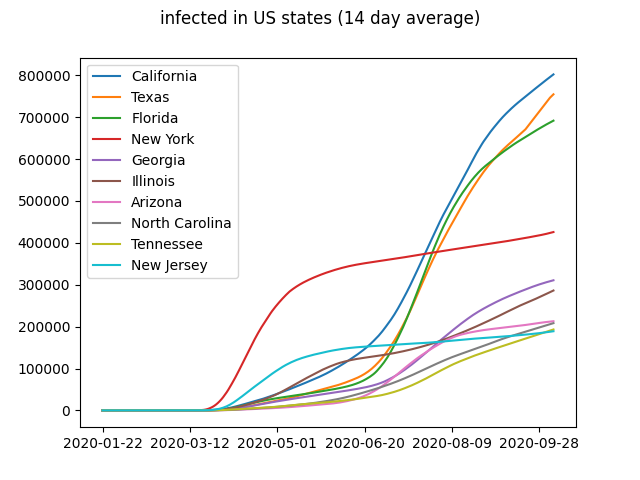

<input type="checkbox" onchange="toggle_avg(this);" checked> Use 14 day average
## Confirmed infections

### Top 10 Countries

### Top 10 US States

## Deaths

### Top 10 Countries

### Top 10 US States

## Active infections

### Top 10 Countries

### Top 10 US States

