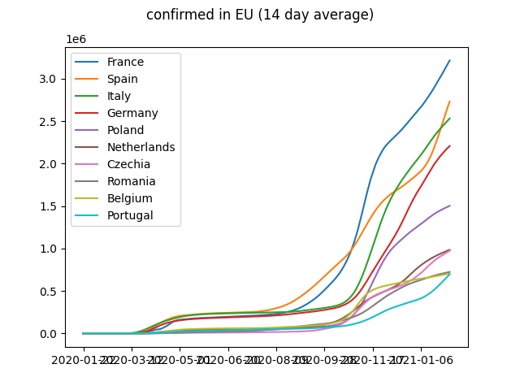
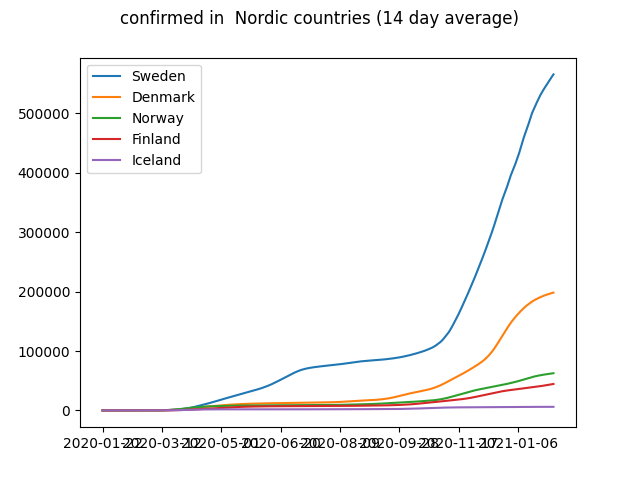
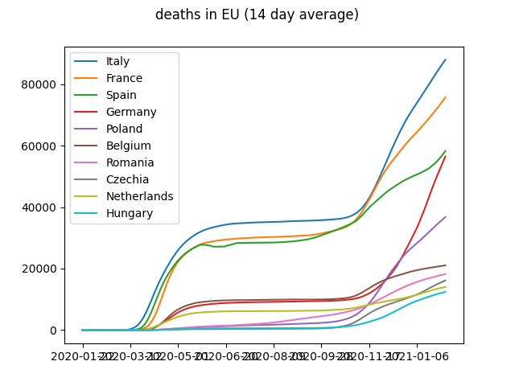
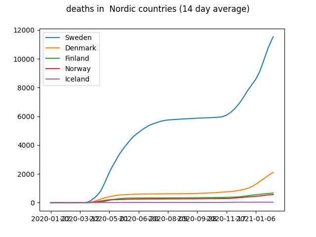
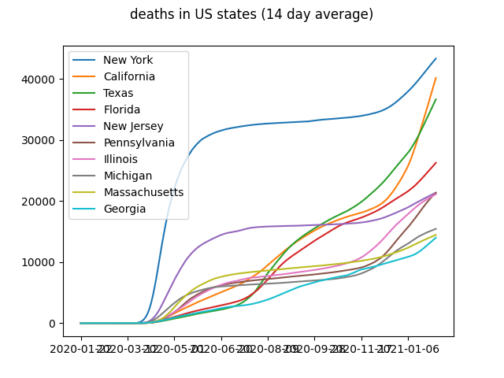
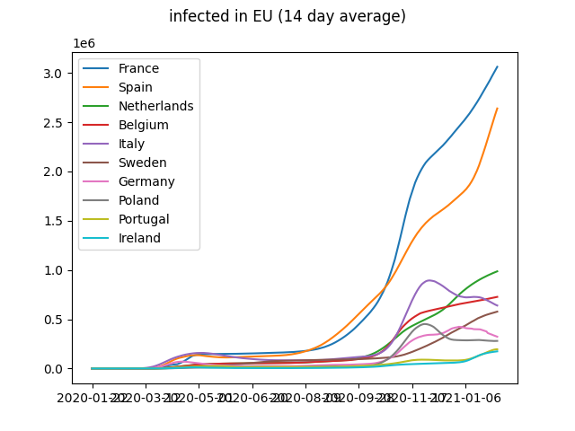
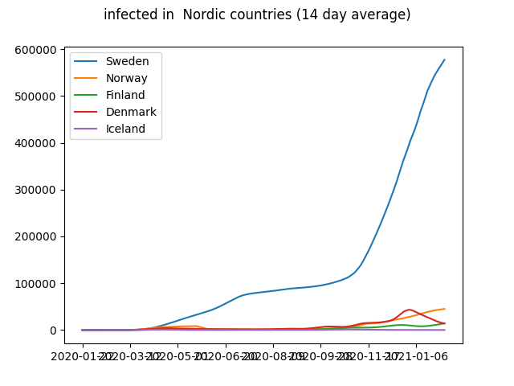

This page was last updated at {{ "now" | date: "%Y-%m-%d %H:%M" }}.

This page was last updated at {{ "now" | date: "%Y-%m-%d %H:%M" }}.

<input type="checkbox" onchange="toggle_avg(this);" checked> Use 14 day average
## Confirmed infections

### Top 10 Countries

### Top 10 US States

## Deaths

### Top 10 Countries

### Top 10 US States

## Current infections

Johns Hopkins has data for confirmed cases, deaths and recoveries. When
deaths and recoveries are subtracted from confirmed cases, we get estimate 
of current infections. The advantage is that this is not cumulative and
produces downward trend when the peak of epidemy is passed.

> There is something strange happening to Spain's figures. Probably
> yesterday's data for recovered was missing causing miscalculation.

### Top 10 Countries

### Countries that seem to have passed peak of epidemy


